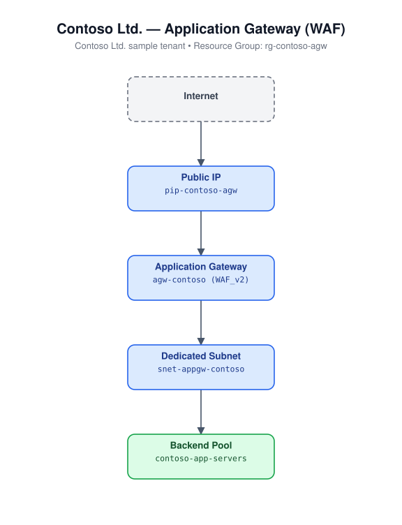

# Azure IaC Templates

Infrastructure-as-Code templates for the **20 most popular Azure
deployments**, implemented three ways: **Terraform**, **Bicep**, and
**ARM (JSON)**. Pick whichever tool your team standardizes on — every
service is implemented consistently across all three.

See [docs/catalog.md](docs/catalog.md) for the full list of services, the
directory layout, and the conventions each template follows.

Every module includes a sample architecture diagram using a fictional
**Contoso Ltd.** tenant so you can see the resource topology before you
deploy — for example, the Application Gateway module:



## The 20 deployments

1. Linux Virtual Machine
2. Windows Virtual Machine
3. Virtual Network (multi-subnet + NSG)
4. Storage Account
5. App Service (Linux Web App)
6. Azure Functions (Consumption)
7. Azure SQL Database
8. Azure Database for PostgreSQL Flexible Server
9. Azure Kubernetes Service (AKS)
10. Azure Container Registry
11. Azure Container Instances
12. Azure Key Vault
13. Azure Cosmos DB (SQL API)
14. Azure Cache for Redis
15. Standard Load Balancer
16. Application Gateway (v2, WAF)
17. Virtual Machine Scale Set
18. Service Bus (namespace + queue)
19. Log Analytics Workspace + Application Insights
20. Azure Front Door (Standard)

## Repository layout

```
terraform/<NN>-<slug>/   # main.tf, variables.tf, outputs.tf, terraform.tfvars.example, README.md
bicep/<NN>-<slug>/       # main.bicep, main.parameters.json, README.md
arm/<NN>-<slug>/         # azuredeploy.json, azuredeploy.parameters.json, README.md
docs/catalog.md          # full catalog + conventions
```

Each `<NN>-<slug>` module is self-contained — read its own `README.md` for
the exact inputs and deploy commands.

## Prerequisites

- An Azure subscription and [Azure CLI](https://learn.microsoft.com/cli/azure/install-azure-cli) (`az login`)
- For Terraform modules: [Terraform](https://developer.hashicorp.com/terraform/install) >= 1.9
- For Bicep/ARM modules: Azure CLI with the Bicep extension (`az bicep install`)

## Quick start

**Terraform**

```bash
cd terraform/01-linux-virtual-machine
terraform init
cp terraform.tfvars.example terraform.tfvars   # edit values first
terraform apply -var-file=terraform.tfvars
```

**Bicep**

```bash
az group create --name rg-demo --location eastus
az deployment group create \
  --resource-group rg-demo \
  --template-file bicep/01-linux-virtual-machine/main.bicep \
  --parameters bicep/01-linux-virtual-machine/main.parameters.json
```

**ARM**

```bash
az group create --name rg-demo --location eastus
az deployment group create \
  --resource-group rg-demo \
  --template-file arm/01-linux-virtual-machine/azuredeploy.json \
  --parameters arm/01-linux-virtual-machine/azuredeploy.parameters.json
```

## Security notes

- No secrets are hardcoded anywhere in this repo. Passwords/keys are
  required input parameters (marked sensitive) with no defaults, or SSH
  key auth is used instead.
- Review and adjust default SKUs, network rules, and firewall rules
  before deploying to production — defaults favor being deployable and
  inexpensive over production-hardening.
- Always run `terraform plan` / `az deployment group what-if` before
  applying to a real subscription.

## License

MIT — see [LICENSE](LICENSE).
