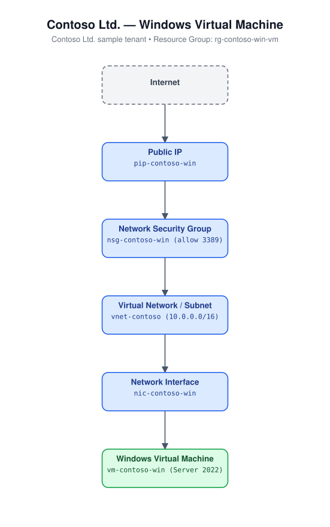

# Windows Virtual Machine

Deploys a single Windows Server 2022 Datacenter Azure Edition virtual
machine with its own virtual network, subnet, network security group (RDP
access only), static Standard public IP address, and network interface.

## Architecture



## Resources

- Microsoft.Network/networkSecurityGroups (allows inbound TCP 3389)
- Microsoft.Network/virtualNetworks (1 subnet)
- Microsoft.Network/publicIPAddresses (Standard, Static)
- Microsoft.Network/networkInterfaces
- Microsoft.Compute/virtualMachines (Windows Server 2022 Datacenter Azure Edition)

## Required inputs

| Parameter | Description | Default |
|---|---|---|
| `namePrefix` | Prefix used to build resource names | `winvm` |
| `location` | Azure region | resource group location |
| `vmSize` | VM size | `Standard_B2s` |
| `adminUsername` | Admin username (required, no default) | - |
| `adminPassword` | Admin password (required, secureString, no default) | - |
| `sourceAddressPrefix` | CIDR/`*` allowed to reach RDP 3389 | `*` (restrict in production) |
| `tags` | Tags applied to all resources | `{ environment: dev, project: azure-iac-templates }` |

## Prerequisites

None besides choosing an admin username/password that meets Azure's
complexity requirements (12-123 characters, 3 of: uppercase, lowercase,
digit, special character).

## Deploy

```bash
az group create --name <rg-name> --location eastus
az deployment group create --resource-group <rg-name> --template-file azuredeploy.json --parameters azuredeploy.parameters.json
```
