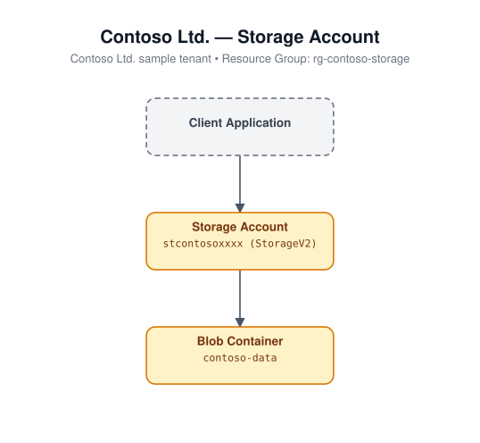

# Storage Account

Deploys a general-purpose v2 storage account with secure defaults
(HTTPS-only traffic, TLS 1.2 minimum, no public blob access) and a sample
blob container.

## Architecture



## Resources

- Microsoft.Storage/storageAccounts (StorageV2)
- Microsoft.Storage/storageAccounts/blobServices/containers

## Required inputs

| Parameter | Description | Default |
|---|---|---|
| `namePrefix` | Prefix used to build the (globally-unique) storage account name | `stg` |
| `location` | Azure region | resource group location |
| `skuName` | Storage account SKU | `Standard_LRS` |
| `containerName` | Name of the sample blob container | `sample` |
| `tags` | Tags applied to all resources | `{ environment: dev, project: azure-iac-templates }` |

## Deploy

```bash
az group create --name <rg-name> --location eastus
az deployment group create --resource-group <rg-name> --template-file azuredeploy.json --parameters azuredeploy.parameters.json
```
