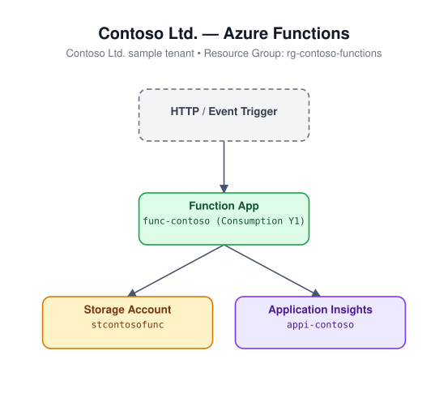

# Azure Functions

Deploys a Consumption-plan (Y1) Linux Function App with a backing storage
account and an Application Insights component wired up for monitoring.

## Architecture



## Resources

- Microsoft.Storage/storageAccounts
- Microsoft.Insights/components (Application Insights)
- Microsoft.Web/serverfarms (Consumption plan, Y1)
- Microsoft.Web/sites (Function App, kind `functionapp,linux`)

## Required inputs

| Parameter | Description | Default |
|---|---|---|
| `namePrefix` | Prefix used to build resource names (storage account and function app names are globally unique) | `func` |
| `location` | Azure region | resource group location |
| `storageSkuName` | SKU for the backing storage account | `Standard_LRS` |
| `tags` | Tags applied to all resources | `{ environment: dev, project: azure-iac-templates }` |

## Deploy

```bash
az group create --name <rg-name> --location eastus
az deployment group create --resource-group <rg-name> --template-file azuredeploy.json --parameters azuredeploy.parameters.json
```
