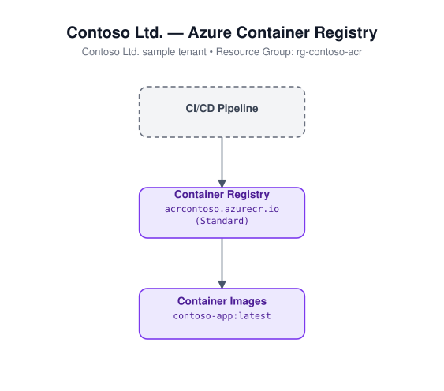

# Container Registry

Deploys an Azure Container Registry (ACR) with the admin user disabled
(use RBAC / `az acr login` for authentication instead).

## Architecture



## Resources

- Microsoft.ContainerRegistry/registries

## Required inputs

| Parameter | Description | Default |
|---|---|---|
| `namePrefix` | Prefix used to build the (globally-unique) registry name | `acr` |
| `location` | Azure region | resource group location |
| `skuName` | Registry SKU | `Standard` |
| `tags` | Tags applied to all resources | `{ environment: dev, project: azure-iac-templates }` |

## Deploy

```bash
az group create --name <rg-name> --location eastus
az deployment group create --resource-group <rg-name> --template-file azuredeploy.json --parameters azuredeploy.parameters.json
```
