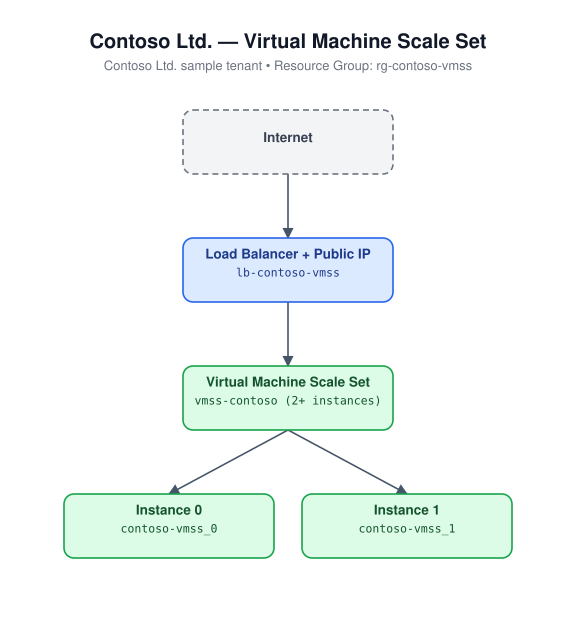

# VM Scale Set

Deploys a Linux Virtual Machine Scale Set (Ubuntu 22.04, SSH-key auth only,
Manual upgrade policy) behind a Standard Load Balancer with a backend
address pool, a TCP health probe, and an inbound NAT pool for SSH access to
individual instances, in a dedicated virtual network.

## Architecture



## Resources

- Microsoft.Network/virtualNetworks (dedicated subnet)
- Microsoft.Network/publicIPAddresses (Standard, Static)
- Microsoft.Network/loadBalancers (backend pool, TCP probe on port 80, LB rule, inbound NAT pool 50000-50019 -> 22)
- Microsoft.Compute/virtualMachineScaleSets (Ubuntu 22.04 LTS Gen2, Manual upgrade policy)

## Required inputs

| Parameter | Description | Default |
|---|---|---|
| `namePrefix` | Prefix used to build resource names | `vmss` |
| `location` | Azure region | resource group location |
| `vmSize` | VM size for each instance | `Standard_B2s` |
| `instanceCount` | Number of instances | `2` |
| `adminUsername` | Admin username | `azureuser` |
| `sshPublicKey` | SSH public key content (required, no default) | - |
| `tags` | Tags applied to all resources | `{ environment: dev, project: azure-iac-templates }` |

## Prerequisites

Generate an SSH key pair if you don't already have one:

```bash
ssh-keygen -t rsa -b 4096 -f ~/.ssh/azure_vmss
```

Then set `sshPublicKey` in `azuredeploy.parameters.json` to the contents of
`~/.ssh/azure_vmss.pub`. To reach an individual instance over SSH, connect
to the load balancer's public IP on a port in the 50000-50019 range (NAT
maps to instance port 22).

## Deploy

```bash
az group create --name <rg-name> --location eastus
az deployment group create --resource-group <rg-name> --template-file azuredeploy.json --parameters azuredeploy.parameters.json
```
