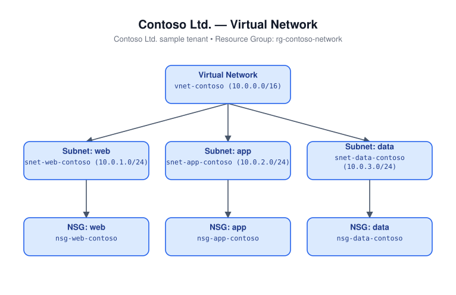

# Virtual Network (Bicep)

Deploys a virtual network with three subnets (`web`, `app`, `data`), each
associated with its own network security group with sane default rules
(web allows inbound HTTP/HTTPS from the Internet, app allows inbound traffic
from the web subnet, data allows inbound traffic from the app subnet).

## Architecture



## Resources

- `Microsoft.Network/virtualNetworks` - VNet with `web`/`app`/`data` subnets
- `Microsoft.Network/networkSecurityGroups` (x3) - one per subnet

## Required inputs

| Parameter | Description | Default |
|---|---|---|
| `namePrefix` | Prefix for resource names | `vnet` |
| `addressSpace` | VNet address space | `["10.0.0.0/16"]` |
| `webSubnetPrefix` | Web subnet CIDR | `10.0.1.0/24` |
| `appSubnetPrefix` | App subnet CIDR | `10.0.2.0/24` |
| `dataSubnetPrefix` | Data subnet CIDR | `10.0.3.0/24` |
| `location` | Azure region | resource group location |
| `tags` | Tags applied to all resources | `{ environment: 'dev', project: 'azure-iac-templates' }` |

## Deploy

```bash
az group create --name <rg-name> --location eastus
az deployment group create --resource-group <rg-name> --template-file main.bicep --parameters main.parameters.json
```
