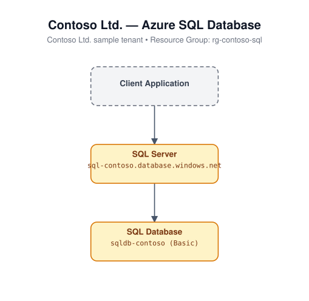

# Azure SQL Database (Bicep)

Deploys an Azure SQL logical server and a single database, with an optional
firewall rule that allows other Azure services to reach the server.

## Architecture



## Resources

- `Microsoft.Sql/servers` - SQL logical server (SQL authentication)
- `Microsoft.Sql/servers/databases` - database
- `Microsoft.Sql/servers/firewallRules` - allows Azure services (conditional)

## Required inputs

| Parameter | Description | Default |
|---|---|---|
| `adminLogin` | Administrator login for the SQL server | *(required)* |
| `adminPassword` | Administrator password for the SQL server (secure) | *(required)* |
| `namePrefix` | Prefix for resource names (globally-unique suffix appended) | `sql` |
| `skuName` | Database SKU | `Basic` |
| `databaseName` | Name of the database | `appdb` |
| `allowAzureServices` | Add a firewall rule allowing Azure services | `true` |
| `location` | Azure region | resource group location |
| `tags` | Tags applied to all resources | `{ environment: 'dev', project: 'azure-iac-templates' }` |

## Deploy

```bash
az group create --name <rg-name> --location eastus
az deployment group create --resource-group <rg-name> --template-file main.bicep --parameters main.parameters.json
```
