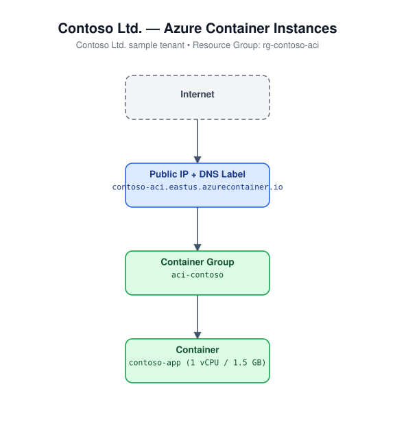

# Container Instances (Bicep)

Deploys a single-container Azure Container Instances (ACI) group with a
public IP and a DNS name label.

## Architecture



## Resources

- `Microsoft.ContainerInstance/containerGroups` - Linux container group, public IP + DNS label

## Required inputs

| Parameter | Description | Default |
|---|---|---|
| `namePrefix` | Prefix for resource names (globally-unique DNS label appended) | `aci` |
| `image` | Container image to deploy | `mcr.microsoft.com/azuredocs/aci-helloworld:latest` |
| `cpuCores` | CPU cores allocated to the container | `1` |
| `memoryInGB` | Memory (GB) allocated to the container | `1.5` |
| `containerPort` | Port exposed by the container | `80` |
| `location` | Azure region | resource group location |
| `tags` | Tags applied to all resources | `{ environment: 'dev', project: 'azure-iac-templates' }` |

## Deploy

```bash
az group create --name <rg-name> --location eastus
az deployment group create --resource-group <rg-name> --template-file main.bicep --parameters main.parameters.json
```
