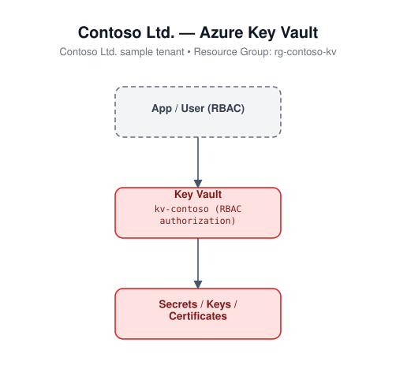

# Key Vault (Bicep)

Deploys an Azure Key Vault with RBAC authorization enabled (no legacy access
policies) and soft delete enabled.

## Architecture



## Resources

- `Microsoft.KeyVault/vaults` - Standard SKU, RBAC authorization

## Required inputs

| Parameter | Description | Default |
|---|---|---|
| `namePrefix` | Prefix for resource names (globally-unique suffix appended) | `kv` |
| `enablePurgeProtection` | Enable purge protection (irreversible once enabled) | `false` |
| `location` | Azure region | resource group location |
| `tags` | Tags applied to all resources | `{ environment: 'dev', project: 'azure-iac-templates' }` |

## Deploy

```bash
az group create --name <rg-name> --location eastus
az deployment group create --resource-group <rg-name> --template-file main.bicep --parameters main.parameters.json
```

> After deployment, grant yourself or an application a role such as
> `Key Vault Secrets Officer` via `az role assignment create` since RBAC
> authorization is used instead of access policies.
