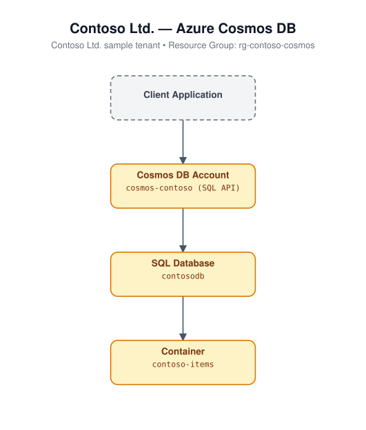

# Cosmos DB (Bicep)

Deploys an Azure Cosmos DB account (SQL API, `GlobalDocumentDB` kind,
Session consistency, single write region) with a SQL database and container.

## Architecture



## Resources

- `Microsoft.DocumentDB/databaseAccounts` - Cosmos account, Session consistency
- `Microsoft.DocumentDB/databaseAccounts/sqlDatabases` - database
- `Microsoft.DocumentDB/databaseAccounts/sqlDatabases/containers` - container

## Required inputs

| Parameter | Description | Default |
|---|---|---|
| `namePrefix` | Prefix for resource names (globally-unique suffix appended) | `cosmos` |
| `databaseName` | Name of the SQL database | `appdb` |
| `containerName` | Name of the SQL container | `items` |
| `partitionKeyPath` | Partition key path for the container | `/id` |
| `location` | Azure region | resource group location |
| `tags` | Tags applied to all resources | `{ environment: 'dev', project: 'azure-iac-templates' }` |

## Deploy

```bash
az group create --name <rg-name> --location eastus
az deployment group create --resource-group <rg-name> --template-file main.bicep --parameters main.parameters.json
```
