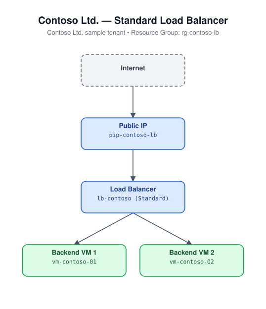

# Load Balancer (Bicep)

Deploys a Standard public Load Balancer with a backend address pool, a TCP
health probe, and a load balancing rule (default 80 -> 80).

## Architecture



## Resources

- `Microsoft.Network/publicIPAddresses` - Standard, static
- `Microsoft.Network/loadBalancers` - Standard SKU, frontend/backend/probe/rule

## Required inputs

| Parameter | Description | Default |
|---|---|---|
| `namePrefix` | Prefix for resource names | `lb` |
| `probePort` | Health probe TCP port | `80` |
| `frontendPort` | Load balancing rule frontend port | `80` |
| `backendPort` | Load balancing rule backend port | `80` |
| `location` | Azure region | resource group location |
| `tags` | Tags applied to all resources | `{ environment: 'dev', project: 'azure-iac-templates' }` |

## Deploy

```bash
az group create --name <rg-name> --location eastus
az deployment group create --resource-group <rg-name> --template-file main.bicep --parameters main.parameters.json
```

> This module deploys the load balancer only. Attach VM/VMSS network
> interfaces to the `backendPool` backend address pool to route traffic to
> your compute resources.
