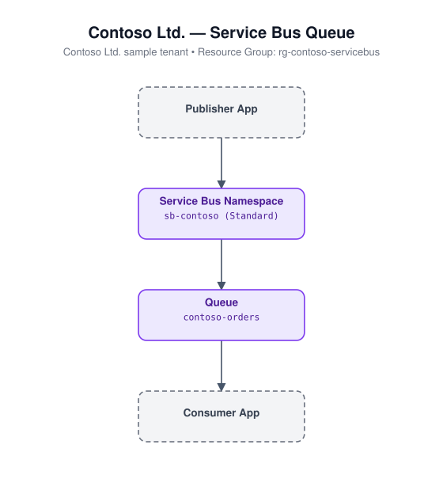

# Service Bus (Bicep)

Deploys a Service Bus namespace and a queue.

## Architecture



## Resources

- `Microsoft.ServiceBus/namespaces` - Standard tier namespace
- `Microsoft.ServiceBus/namespaces/queues` - queue

## Required inputs

| Parameter | Description | Default |
|---|---|---|
| `namePrefix` | Prefix for resource names (globally-unique suffix appended) | `sb` |
| `skuName` | Namespace SKU | `Standard` |
| `queueName` | Name of the queue | `appqueue` |
| `maxSizeInMegabytes` | Maximum queue size (MB) | `1024` |
| `location` | Azure region | resource group location |
| `tags` | Tags applied to all resources | `{ environment: 'dev', project: 'azure-iac-templates' }` |

## Deploy

```bash
az group create --name <rg-name> --location eastus
az deployment group create --resource-group <rg-name> --template-file main.bicep --parameters main.parameters.json
```
