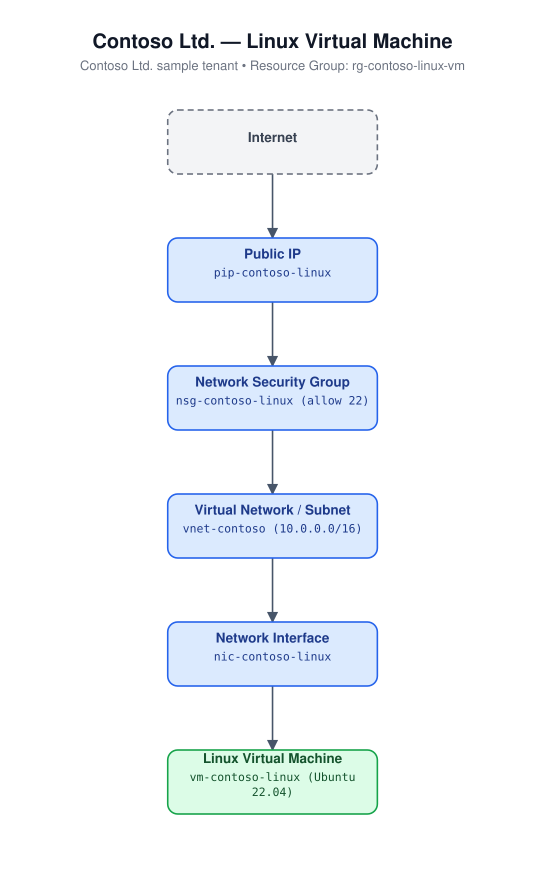

# 01 - Linux Virtual Machine

Deploys a single Ubuntu 22.04 LTS Linux virtual machine with its own virtual
network, subnet, network security group (SSH only), static Standard public
IP, and network interface. Authentication is SSH-key-only; password
authentication is disabled.

## Architecture



## Resources created

- `azurerm_resource_group`
- `azurerm_virtual_network` + `azurerm_subnet`
- `azurerm_network_security_group` (allows inbound TCP 22 from `source_address_prefix`) + association
- `azurerm_public_ip` (Standard, static)
- `azurerm_network_interface`
- `azurerm_linux_virtual_machine` (Ubuntu 22.04 LTS Gen2, SSH key auth)

## Required inputs

| Name | Description | Default |
|------|-------------|---------|
| `ssh_public_key` | SSH public key for `admin_username`. No default. | _(required)_ |
| `name_prefix` | Prefix for resource names | `linuxvm` |
| `location` | Azure region | `eastus` |
| `admin_username` | VM admin username | `azureuser` |
| `vm_size` | VM size | `Standard_B2s` |
| `source_address_prefix` | CIDR allowed to reach SSH; restrict in production | `*` |
| `tags` | Resource tags | see `variables.tf` |

## Prerequisites

Generate an SSH key pair if you don't already have one:

```bash
ssh-keygen -t ed25519 -C "azure-iac-templates" -f ./id_ed25519
```

Paste the contents of `id_ed25519.pub` into `ssh_public_key` in your tfvars file.

## Usage

```bash
cd terraform/01-linux-virtual-machine
terraform init
terraform apply -var-file=terraform.tfvars.example
```

Connect once deployed:

```bash
ssh azureuser@<public_ip_address>
```
