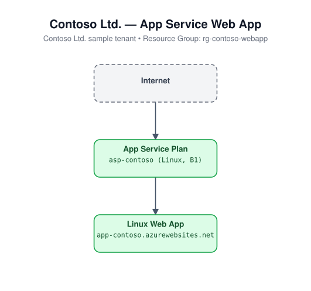

# 05 - App Service Web App

Deploys a Linux App Service Plan and a Linux Web App running a Node.js
application stack, with HTTPS-only enforced.

## Architecture



## Resources created

- `azurerm_resource_group`
- `random_string` (uniqueness suffix)
- `azurerm_service_plan` (Linux)
- `azurerm_linux_web_app` (Node.js stack, `https_only = true`)

## Required inputs

| Name | Description | Default |
|------|-------------|---------|
| `name_prefix` | Prefix for resource names (random suffix appended to app name) | `iacweb` |
| `location` | Azure region | `eastus` |
| `sku_name` | App Service Plan SKU | `B1` |
| `node_version` | Node.js version for the application stack | `20-lts` |
| `tags` | Resource tags | see `variables.tf` |

No inputs are required beyond the defaults; this module deploys standalone.

## Usage

```bash
cd terraform/05-app-service-webapp
terraform init
terraform apply -var-file=terraform.tfvars.example
```
