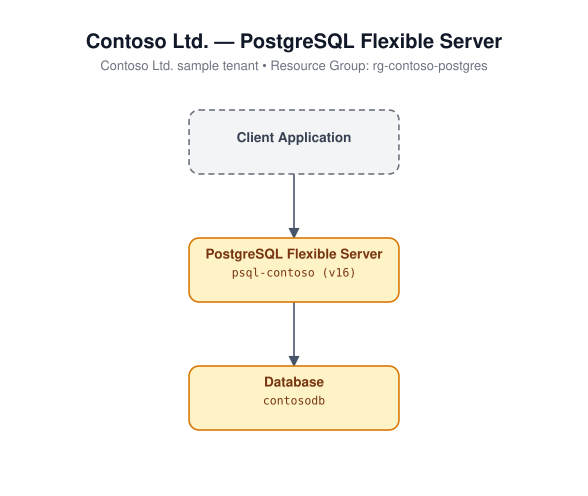

# 08 - PostgreSQL Flexible Server

Deploys an Azure Database for PostgreSQL Flexible Server (v16) with a
database and an optional firewall rule allowing other Azure services to
connect.

## Architecture



## Resources created

- `azurerm_resource_group`
- `random_string` (uniqueness suffix)
- `azurerm_postgresql_flexible_server` (version 16)
- `azurerm_postgresql_flexible_server_firewall_rule` (optional, `allow_azure_services`)
- `azurerm_postgresql_flexible_server_database`

## Required inputs

| Name | Description | Default |
|------|-------------|---------|
| `admin_login` | PostgreSQL administrator login (sensitive). No default. | _(required)_ |
| `admin_password` | PostgreSQL administrator password (sensitive). No default. | _(required)_ |
| `name_prefix` | Prefix for resource names (random suffix appended) | `iacpsql` |
| `location` | Azure region | `eastus` |
| `sku_name` | Compute/storage SKU | `B_Standard_B1ms` |
| `storage_mb` | Allocated storage (MB) | `32768` |
| `allow_azure_services` | Add firewall rule for Azure services | `true` |
| `tags` | Resource tags | see `variables.tf` |

## Prerequisites

Choose a strong `admin_password`. Do not commit real credentials to source
control - pass them via `-var`, an environment variable, or a secrets manager.

## Usage

```bash
cd terraform/08-postgresql-flexible-server
terraform init
terraform apply -var-file=terraform.tfvars.example
```
