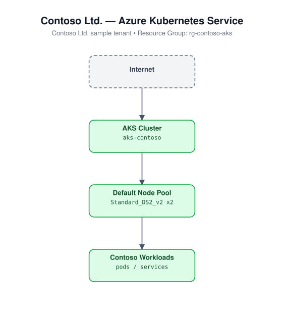

# 09 - AKS Cluster

Deploys an Azure Kubernetes Service (AKS) cluster with a system-assigned
managed identity and a single default node pool.

## Architecture



## Resources created

- `azurerm_resource_group`
- `azurerm_kubernetes_cluster` (SystemAssigned identity, default node pool `Standard_DS2_v2`)

## Required inputs

| Name | Description | Default |
|------|-------------|---------|
| `name_prefix` | Prefix for resource names | `iacaks` |
| `location` | Azure region | `eastus` |
| `dns_prefix` | DNS prefix for the cluster API server | `iacaks` |
| `node_count` | Number of nodes in the default node pool | `2` |
| `tags` | Resource tags | see `variables.tf` |

No inputs are required beyond the defaults; this module deploys standalone.

## Usage

```bash
cd terraform/09-aks-cluster
terraform init
terraform apply -var-file=terraform.tfvars.example
```

Fetch credentials once deployed:

```bash
az aks get-credentials --resource-group <name_prefix>-rg --name <name_prefix>-aks
```
