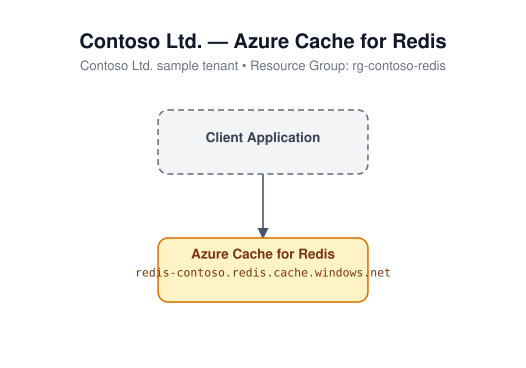

# 14 - Redis Cache

Deploys an Azure Cache for Redis instance with TLS 1.2 minimum and the
non-SSL port disabled.

## Architecture



## Resources created

- `azurerm_resource_group`
- `random_string` (uniqueness suffix)
- `azurerm_redis_cache` (family `C`, `non_ssl_port_enabled = false`, `minimum_tls_version = "1.2"`)

## Required inputs

| Name | Description | Default |
|------|-------------|---------|
| `name_prefix` | Prefix for the cache name (random suffix appended) | `iacredis` |
| `location` | Azure region | `eastus` |
| `sku_name` | Cache SKU | `Basic` |
| `capacity` | Cache size within the SKU family | `0` |
| `tags` | Resource tags | see `variables.tf` |

No inputs are required beyond the defaults; this module deploys standalone.

## Usage

```bash
cd terraform/14-redis-cache
terraform init
terraform apply -var-file=terraform.tfvars.example
```
