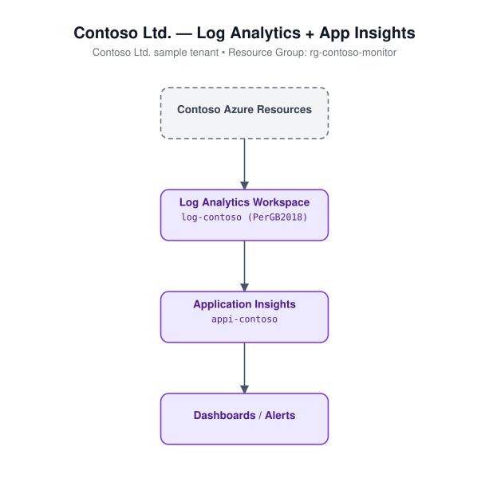

# 19 - Log Analytics Workspace

Deploys a Log Analytics workspace and a workspace-based Application
Insights instance linked to it.

## Architecture



## Resources created

- `azurerm_resource_group`
- `azurerm_log_analytics_workspace` (`sku = "PerGB2018"`)
- `azurerm_application_insights` (workspace-based, `application_type = "web"`)

## Required inputs

| Name | Description | Default |
|------|-------------|---------|
| `name_prefix` | Prefix for resource names | `iaclaw` |
| `location` | Azure region | `eastus` |
| `retention_in_days` | Log retention period (days) | `30` |
| `tags` | Resource tags | see `variables.tf` |

No inputs are required beyond the defaults; this module deploys standalone.

## Usage

```bash
cd terraform/19-log-analytics-workspace
terraform init
terraform apply -var-file=terraform.tfvars.example
```
