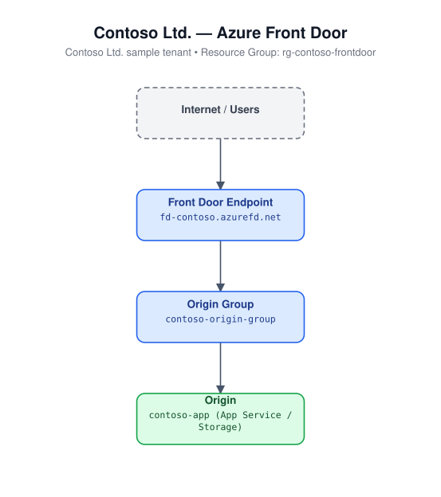

# 20 - CDN / Azure Front Door

Deploys an Azure Front Door (Standard) profile with an endpoint, an origin
group with a health probe, an origin pointing at `origin_host_name`, and a
route that forwards all traffic HTTPS-only with HTTP-to-HTTPS redirect
enabled.

## Architecture



## Resources created

- `azurerm_resource_group`
- `random_string` (uniqueness suffix)
- `azurerm_cdn_frontdoor_profile` (`sku_name = "Standard_AzureFrontDoor"`)
- `azurerm_cdn_frontdoor_endpoint`
- `azurerm_cdn_frontdoor_origin_group` (with health probe)
- `azurerm_cdn_frontdoor_origin`
- `azurerm_cdn_frontdoor_route` (HTTPS redirect enabled)

## Required inputs

| Name | Description | Default |
|------|-------------|---------|
| `origin_host_name` | Hostname of the origin to front (e.g. a web app or storage static site hostname). No default. | _(required)_ |
| `name_prefix` | Prefix for resource names (random suffix appended to endpoint name) | `iacafd` |
| `location` | Azure region for the resource group | `eastus` |
| `tags` | Resource tags | see `variables.tf` |

## Usage

```bash
cd terraform/20-cdn-front-door
terraform init
terraform apply -var-file=terraform.tfvars.example
```
